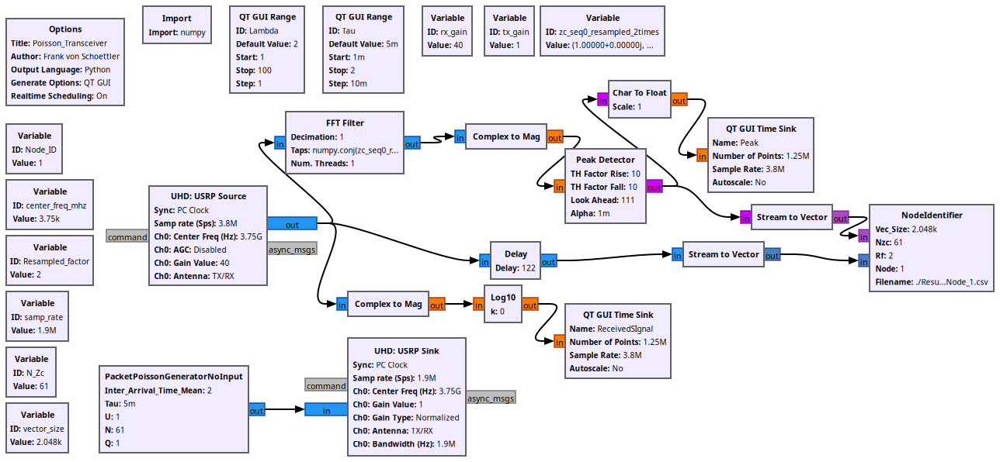

# Code-for-Radio-Channel-Measurements-in-D2X-Communication-

This project implements a wireless measurement setup where transmitters send short Zadoff–Chu (ZC) sounding sequences at random intervals following a Poisson process. Each transmission lasts a variable amount of milliseconds and contains two alternating ZC sequences: one reference and one shifted by a node-specific offset for identification. The system operates using a pure ALOHA protocol with no scheduling or channel sensing, relying on short bursts and low traffic to minimize collisions. On the receiver side, a matched filter detects incoming sequences and identifies transmitters based on peak spacing, while an embedded Python block logs metadata such as sender, receiver, timestamp, and received power. Collisions are detected when the peak spacing deviates from the expected pattern, and corrupted transmissions are discarded.

# Details of the GNU Radio Flowgraph
This repository contains a GNU Flowgraph of the transceiver. 

  

1. The transmitter side has a python block called PacketPoissonGenerator with some variables.
  a. Inter_Arrival_Time_Mean: The mean on how packets per second the node sends
  b. Tau is the packet length. It is recommended to set it to a few ms to avoid collisions between nodes  
  c. U is the root of the ZC sequence. It is recommended to leave U=1, otherwise you need to change the FFT Filter block taps at the receiver side
  d. N is the length of the sequence. It is recommended to use a prime number to improve the correlation properties of the ZC sequence
  e. Q produces a sequence that is equal to the cyclically shifted version. This is used for node identification. Each USRP device should have a different Q value.
2. The block gets from a exponential distribution with mean 
3. The receiver identifiy the received signal through correlation.
  a. The sampling rate at the receiver is twice the transmitter to improve correlation with the reference ZC sequence. If the resampling factor is changed, then the FFT Filter block requires taps that are adapted to the new sampling rate of the receiver.
  b. The FFT Filter block has as taps the complex conjugate version of the ZC sequence with root index U=1. This corresponds to applying correlation to the received signal in a compute efficient way.   
  c. A Peak Detector block detects peaks from the correlated signal.
  d. The NodeIdentifier python Block receives as input the received signal as well as the peaks from the Peak Detector. The distance of the peaks corresponds to the length of the ZC sequence +- the index Q. Based on this, the node is identifies and the receive power is calculated as the mean of the received power on the packet. The resampling factor of 2 between receiver and transmitter is considered here.

# Measured Data

Data was measured in a running industrial factory from SEW EURODRIVE in Graben Neudorf, Germany, back in Februar of 2025.
The measured data was saved in a .csv file for analysis of the paper Radio Channel Measurements of D2X Communication in an Running Industrial Factory.

The data includes the senderID and receiverID (which nodes sent and received the signal), the timestamp when the signal starts and the timestamp where it ends. The received power is dBm is calculated as the mean value of the amplitude squeared of the received signal between start and end time. Furthermore, the coordinates of the nodes in the production hall were added up from the AGVs. 
